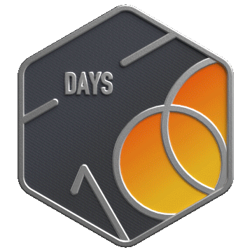
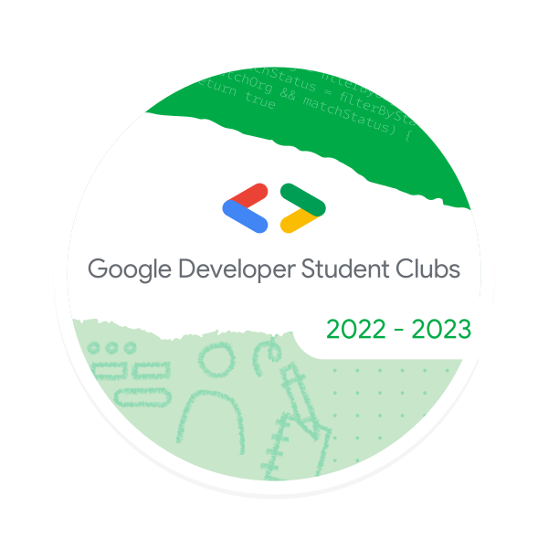

## Table of Contents

- [Work Experience](#work-experience)
  - [Karrot, Daangn Market (당근마켓)](#karrot-daangn-market-당근마켓)
- [Article](#article)
  - [2023](#2023)
  - [2022](#2022)
- [Accomplishments](#accomplishments)
  - [LeetCode](#leetcode)
    - [List of Accomplishments](#list-of-accomplishments)
  - [Google](#google)
    - [List of Accomplishments](#list-of-accomplishments-1)
- [Awards](#awards)
  - [Hankuk University of Foreign Studies (HUFS)](#hankuk-university-of-foreign-studies-hufs)
    - [List of Awards](#list-of-awards)
  - [Korea University](#korea-university)
    - [List of Awards](#list-of-awards-1)
  - [Google Developer Groups Campus Korea (GDG Campus Korea)](#google-developer-groups-campus-korea-gdg-campus-korea)
    - [List of Awards](#list-of-awards-2)
- [Certificates](#certificates)
  - [2022](#2022)
    - [SQLD](#sqld)

## Work Experience

### Karrot, Daangn Market (당근마켓)

#### Date

- **2023. 01. 02** - **Current**

#### Role

- **Internal Team Server Engineer**

## Article

> All articles were written in Korean. Love to share something that I learn.

### 2023

- **02. 21 :** [파이썬을 처음 사용하는 동료와 효율적으로 일하는 방법](https://medium.com/daangn/%ED%8C%8C%EC%9D%B4%EC%8D%AC%EC%9D%84-%EC%B2%98%EC%9D%8C-%EC%82%AC%EC%9A%A9%ED%95%98%EB%8A%94-%EB%8F%99%EB%A3%8C%EC%99%80-%ED%9A%A8%EC%9C%A8%EC%A0%81%EC%9C%BC%EB%A1%9C-%EC%9D%BC%ED%95%98%EB%8A%94-%EB%B0%A9%EB%B2%95-bb52c3a433fa)

### 2022

- **10. 17 :** [게으름과 부지런함(Lazy vs Eager)](https://weekwith.me/2022/10/17/01/)

## Accomplishments

### LeetCode

#### List of Accomplishments

1. **2022 Annual 100 Days**
2. **SQL I** Study Plan
3. **SQL II** Study Plan
4. **SQL III** Study Plan
5. **Binary Search I** Study Plan

  
  
  
  
  

### Google

#### List of Accomplishments

1. Google Developer Student Clubs Core Member 2022 - 2023

  

## Awards

### Hankuk University of Foreign Studies (HUFS)

#### List of Awards

1. 2022 Smart Campus Idea Festival 3rd Place
2. 2022 HUFSummer Hackathon 1st Place

  
  

### Korea University

#### List of Awards

1. 2022 KU Summer Hackathon 1st Place

  

### Google Developer Groups Campus Korea (GDG Campus Korea)

#### List of Awards

1. 2022 Summer Hackathon 3rd Place

  

## Certificates

### 2022

#### SQLD

  

