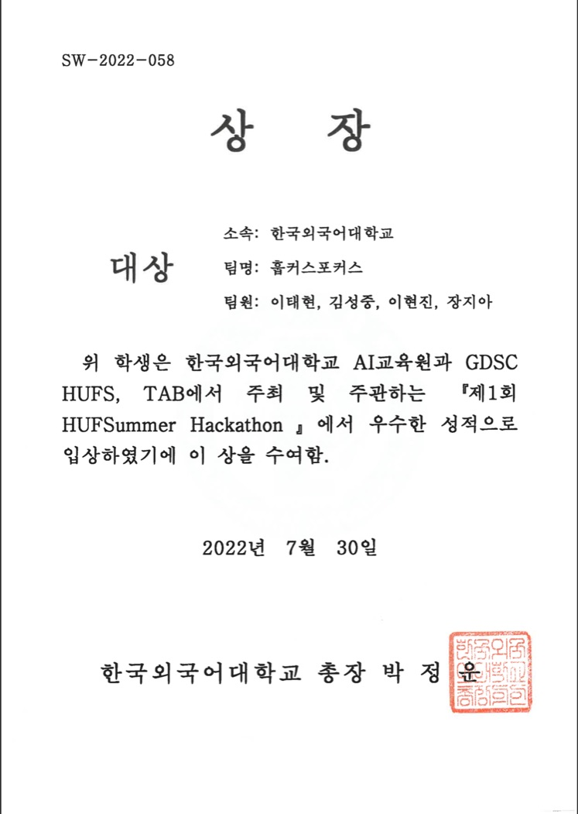
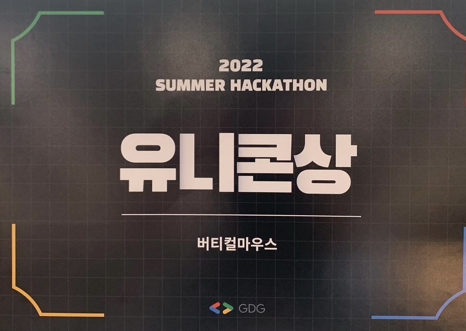

## Accomplishment

### LeetCode

## Awards

### Hankuk University of Foreign Studies (HUFS)

### Korea University

### Google Developer Groups Campus Korea (GDG Campus Korea)

01_2022_KU_Summer_Hackathon.jpeg
